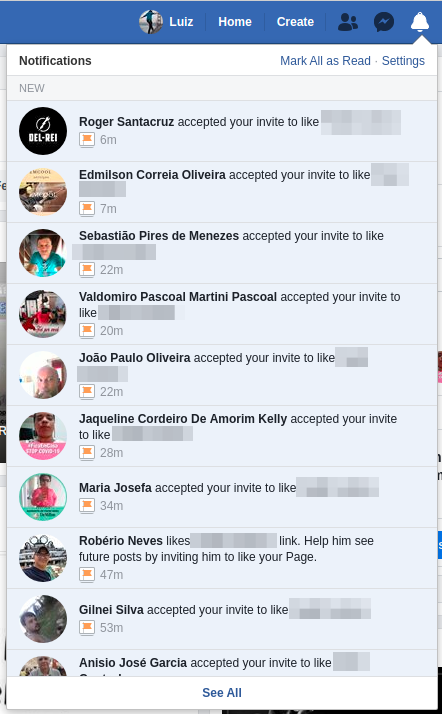

  

    
  

  

  

  

    Built with ❤
  

## Disclaimers

:exclamation: | USE AT YOUR OWN RISK
---: | :---

:exclamation: | WORKS ON MY MACHINE
---: | :---

## Requeriments

- Use Chrome or Chromium

  

 

- Set Default Facebook theme

  

 

- Set Facebook Language as English (US):

  

## How to use

1. Browse your Facebook post page and click on reactions link:

  

 

2. Make sure "Invite to like" dialog is open:

  

 

3. Right-click and choose "Inspect" or press Ctrl+Shift+I

  

 

4. Select Console tab:

  

 

5. Copy invite-to-like script content [here](https://raw.githubusercontent.com/lfreneda/invite-to-like/master/index.js)

6. Paste it and press enter

  

 

7. Sit back and watch the magic! :mage_man:

  

 

8. The result:

  

   
   
   
   
   

  

    
      Made with ❤
    
  
 

